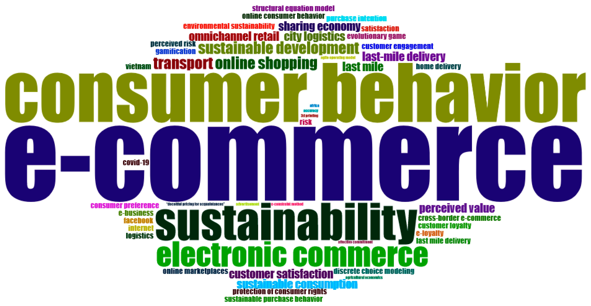
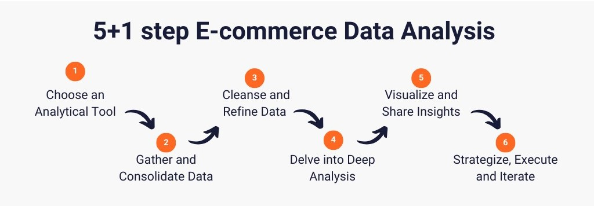
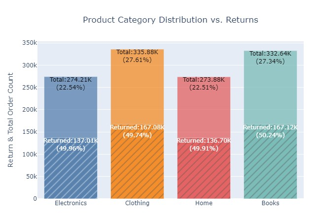
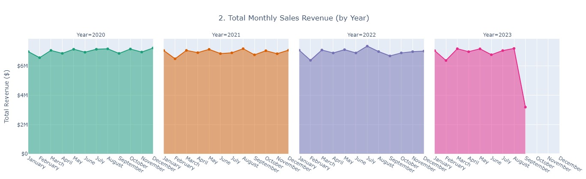
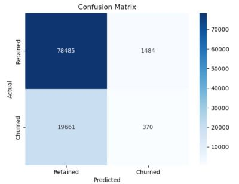
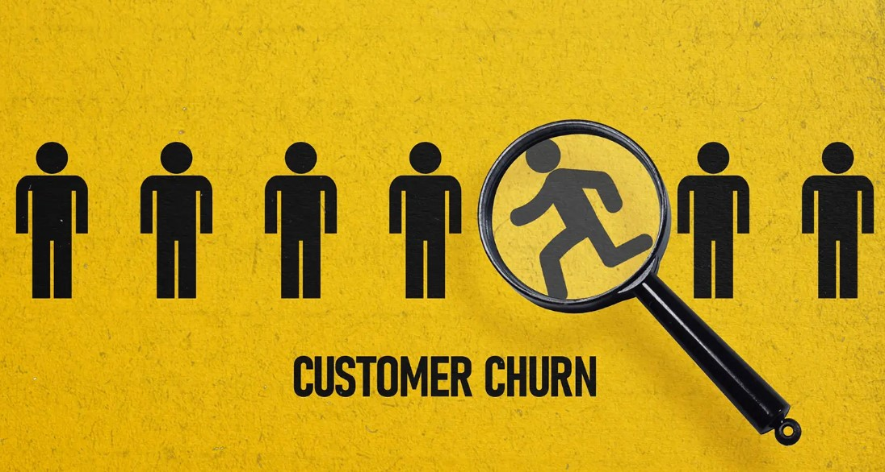
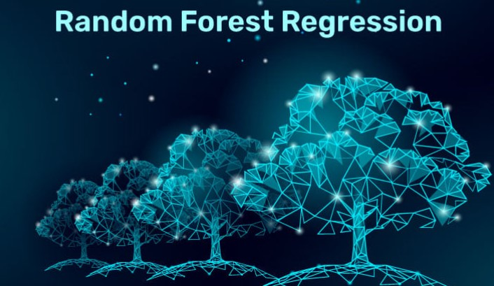
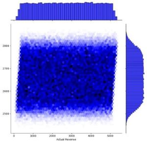
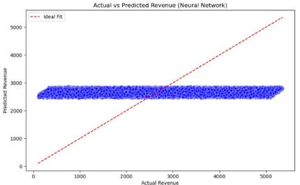

# E-Commerce Sentiment Analysis and Customer Behavior Modeling


## Introduction
This project leverages **machine learning techniques** to analyze customer behaviors using a synthetic dataset collected from Kaggle.
 
The main objectives are:
1. **Sentiment Analysis**: Understand customer satisfaction levels.
2. **Recommendation System**: Enhance user experience and boost sales.
3. **Customer Churn Prediction**: Identify customers likely to leave the platform.
4. **Revenue Prediction**: Forecast expected revenue from customers.


The project applies various data preprocessing, modeling, and evaluation techniques to achieve actionable insights, making it highly relevant for the e-commerce domain.

## Dataset Details
- **Source**: Kaggle (Synthetic Dataset)
- **Size**: More than 500,000 rows
- **Features**:
  - Customer demographics (e.g., age, gender)
  - Purchase behavior (e.g., product categories, payment methods)
  - Revenue and churn indicators




## Project Methodology

1. **Data Preprocessing**:
    * Handled missing values.
    * Scaled numerical features using `StandardScaler`.
    
2. **Visualization**:
    * Visualized metrics using plots for better understanding.

### Visualization from the dataset:

*Product Category Distribution VS. Returns*:



*Total Monthly Sales Revenue*:



2. **Model Training**:
    * Trained different type of model using the various libraries.
        * Deep Neural Network (DNN)
        * Logistic Regression
        * Random Forest Classifier
        
        
3. **Evaluation**:
    - Evaluated the model using 
        * accuracy score 
        
        and
        * confusion matrix.

        

* Retained (TN): 78,485 customers correctly predicted as retained.
* Churned (FN): 19,661 customers incorrectly predicted as retained.
* Churned (TP): 370 customers correctly predicted as churned.
* Retained (FP): 1,484 customers incorrectly predicted as churned.
    
4. **Model Visualization**:

### 2. Customer Churn Prediction



#### Techniques Used:

- **Deep Neural Networks (DNN)**: Predict customer churn for binary classification, specifically predicting churn (whether a customer will leave or stay active).


- **Random Forest Classifier**: Handle class imbalance and improve accuracy. A supervised machine learning algorithm used for binary classification tasks, where the goal is to predict one of two possible outcomes.


#### Key Insights:
- Retention and churn trends provide critical insights into customer behavior, enabling businesses to identify patterns and underlying factors contributing to customer loyalty or attrition. By analyzing these trends, companies can design targeted interventions, such as personalized marketing campaigns, loyalty programs, or improved customer support, to proactively address churn risks.

#### Code Example:
```python
# Building a DNN for churn prediction
from tensorflow.keras.models import Sequential
from tensorflow.keras.layers import Dense, Dropout

model = Sequential([
    Dense(128, activation='relu', input_dim=X_train.shape[1]),
    Dropout(0.2),
    Dense(64, activation='relu'),
    Dropout(0.2),
    Dense(1, activation='sigmoid')  # Binary output
])

model.compile(optimizer='adam', loss='binary_crossentropy', metrics=['accuracy'])
model.fit(X_train, y_train, epochs=50, batch_size=32, validation_split=0.2)
```

---

### 3. Revenue Prediction

## Regression Model for Revenue Prediction

A regression model was developed to predict customer revenue, leveraging key features such as **age**, **gender**, and **purchase history** to capture relevant patterns and trends. These features were carefully selected to provide a comprehensive representation of customer behavior, enabling the model to estimate revenue with greater accuracy. 

The dataset underwent preprocessing steps such as:
- **Scaling numerical features** to standardize their range.
- **Encoding categorical variables** to ensure consistency and compatibility with the regression algorithm.

### Model Performance Evaluation
The model's performance was evaluated using industry-standard metrics:

- **Mean Squared Error (MSE)**:
  - Measures the average squared difference between the actual and predicted values, indicating the overall error magnitude.
- **Mean Absolute Error (MAE)**:
  - Provides a straightforward interpretation of the average absolute difference between predictions and actual outcomes, offering a more intuitive measure of model accuracy.
- **R² Score (Coefficient of Determination)**:
  - Reflects how well the model explains the variability in the target variable, with higher scores indicating better performance.

These metrics demonstrate the model's ability to generalize and provide actionable insights for business forecasting and strategic planning.


#### Example Plot (Placeholder):
- **Hexbin Plot**: Actual vs. Predicted Revenue
- **Scatter Plot**: Ideal Fit vs. Predictions

        


## 4. Sentiment Analysis

**Natural Language Processing (NLP)** techniques are applied to analyze customer reviews and determine their sentiment. This process helps to gauge customer satisfaction and identify areas for improvement based on user feedback.

### Key Steps in Sentiment Analysis:
1. **Text Preprocessing**:
   - Remove unnecessary characters, punctuation, and stopwords.
   - Convert text to lowercase and tokenize it into individual words.
   - Perform stemming or lemmatization to normalize the words.

2. **Feature Extraction**:
   - Convert text data into numerical format using methods such as:
     - **Bag of Words (BoW)**
     - **TF-IDF (Term Frequency-Inverse Document Frequency)**
     - **Word Embeddings** (e.g., Word2Vec or GloVe)

3. **Model Training**:
   - Train a classifier, such as **Logistic Regression**, **Naive Bayes**, or a **Deep Neural Network**, to predict sentiment labels (e.g., positive, negative, or neutral).

4. **Evaluation**:
   - Use metrics like accuracy, precision, recall, and F1-score to measure the model's performance.


#### Code Example:
```python
@app.route('/chatbot', methods=['POST'])
def chatbot():
    data = request.get_json()
    age = data.get('age')
    gender = data.get('gender')
    purchase_amount = data.get('purchase_amount')

    # Validate and preprocess input
    if age is None or gender not in ['Male', 'Female']:
        return jsonify({'response': 'Invalid input'})

    features = np.array([[age, 1 if gender == 'Male' else 0, purchase_amount]])
    prediction = model.predict(features)[0]
    return jsonify({'response': 'Customer likely to churn' if prediction > 0.5 else 'Customer retained'})
```

       
## Conclusion

This project demonstrates the power of **machine learning** in transforming e-commerce businesses by addressing key challenges like **churn prediction**, **revenue forecasting**, and **sentiment analysis**. These insights enable targeted retention strategies, accurate revenue planning, and improved customer satisfaction.


With real-time predictions via a **Flask API**, the models are practical and deployment-ready, helping businesses enhance customer experience, drive profitability, and gain a competitive edge through data-driven decisions.

---

## Team Members
- Anupreet
- Ashish
- Sirisha
- Zara
- Zena

---

## Thank You!
For questions, feel free to reach out!
